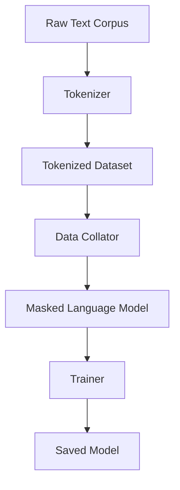
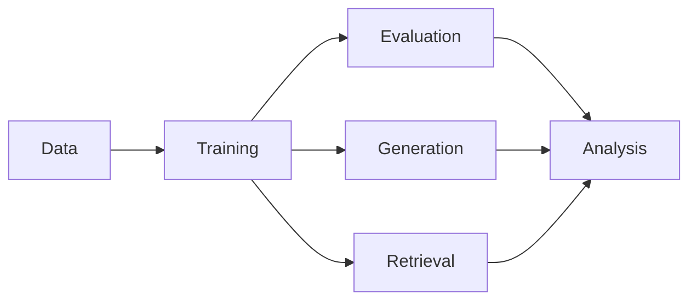
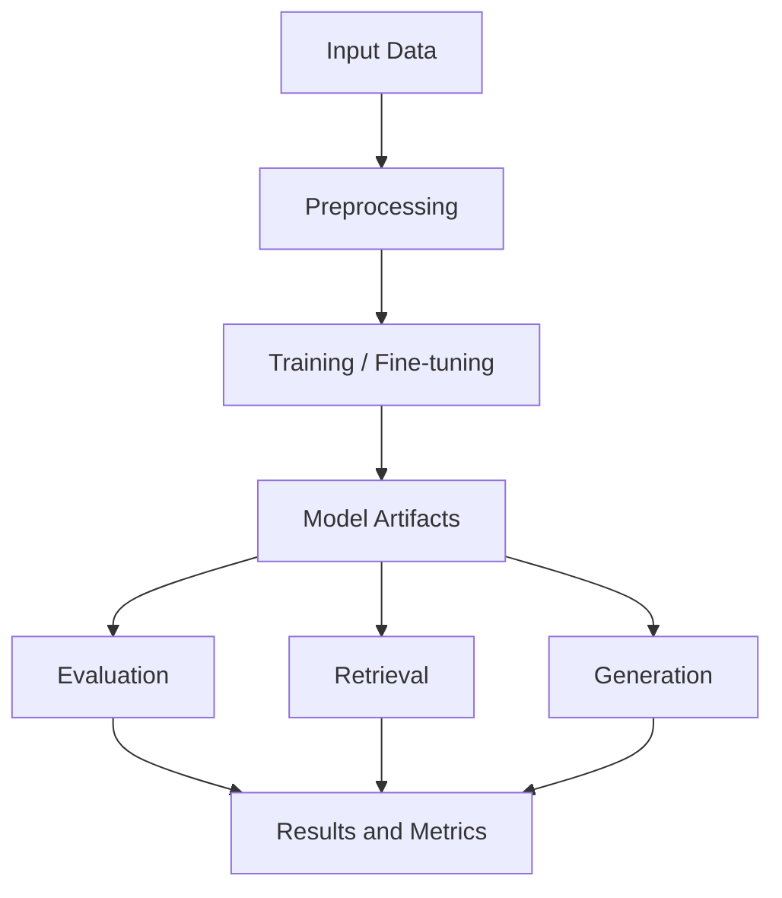

[](https://www.python.org/)
[](https://github.com/huggingface/transformers)
[](LICENSE)

# StructBERT

StructBERT is a lightweight project for training and experimenting with BERT-based language modeling and related NLP tasks. It uses Hugging Face Transformers and Datasets for training workflows.

## Features

- BERT-based masked language modeling
- Uses Hugging Face `Trainer` for training
- Supports custom text corpora
- Saves trained models for later use
- Includes retrieval, generation, and evaluation components

## Project Structure

```text
StructBERT/
├── data/
├── evaluation/
├── generation/
├── retrieval/
├── src/
├── training/
├── .gitignore
├── README.md
├── readme.md
├── requirements.txt
└── structbert-encoder.ipynb
```

## Graphs

### Training Pipeline



### Project Flow



## System Design

StructBERT is organized around modular NLP components:

- **Data Layer**: Stores training corpora and any additional datasets used for experiments.
- **Training Layer**: Handles tokenizer setup, dataset preprocessing, MLM training, and model saving.
- **Retrieval Layer**: Supports lookup or similarity-based access to relevant text or embeddings.
- **Generation Layer**: Produces model outputs for downstream text generation tasks.
- **Evaluation Layer**: Contains scripts or notebooks for measuring model quality and comparing results.
- **Source Layer**: Shared utilities and reusable code live under `src/`.

### High-Level Architecture



## Usage

### 1) Install dependencies

```bash
pip install -r requirements.txt
```

If you do not have a requirements file yet, you can install the core packages manually:

```bash
pip install transformers datasets torch
```

### 2) Prepare data

Place your training corpus in:

```text
data/mlm/dsa_corpus.txt
```

Each line can contain a sentence, paragraph, or training sample.

### 3) Train the model

```bash
python training/train_mlm.py
```

### 4) Check the output

The trained model will be saved to:

```text
models/structbert_mlm
```

## Requirements

- Python 3.8+
- `transformers`
- `datasets`
- `torch`

## Dataset

The training script expects a plain text file at:

```text
data/mlm/dsa_corpus.txt
```

## Training

Run the MLM training script with:

```bash
python training/train_mlm.py
```

### What the script does

1. Loads the tokenizer and model from `bert-base-uncased`
2. Loads the text dataset from `data/mlm/dsa_corpus.txt`
3. Tokenizes each sample with truncation to 128 tokens
4. Applies masked language modeling with a 15% masking probability
5. Trains the model for 3 epochs
6. Saves the final model to `models/structbert_mlm`

## Output

After training, you should find the trained model files in:

```text
models/structbert_mlm
```

You can later reload the model with Hugging Face APIs.

## Notes

- The current script uses a pretrained base BERT model as a starting point.
- If you want to train on a larger corpus, consider adjusting:
  - `max_length`
  - `per_device_train_batch_size`
  - `num_train_epochs`
  - `learning_rate`

## Future Improvements

- Add evaluation and validation splits
- Add support for dynamic dataset paths
- Add configuration via command-line arguments
- Add inference script for testing the trained model
- Add requirements file or environment setup instructions
- Add usage examples for retrieval and generation modules

## License

Add your project license here.
